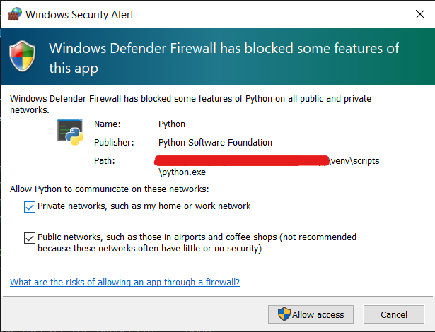

# Google Meet Call Alerter  💻

Tired of sitting through a boring meeting? But obliged to respond when called out? Worry not, you have the "Google Meet Call Alerter". It listens to the meetings on your behalf, and when it thinks that someone is calling your name out or trying to get attention, it alerts you!

So, you can sit back and relax, until someone calls you!

****Worried about Data Privacy?****
None of the data collected by this software leaves your computer. Whatever data is collected, it stays within the software and only for as long as the software is running. When the program restarts, all the previous data is lost. And on top of all that, this program does not use the internet for any other purpose apart from running the Google Meet meeting. Don't beleive me? I have open sourced the code. See for yourself!

**Disclaimer**: This is to be considered as a fun project. This repo's owner, nor Google are responsible for the outcomes of usage of this software. Use at your own risk.

### Dependencies

* `selenium`
* `clipboard`
* `playsound`
* `pycaw`

These have been uploaded as `requirements.txt`
You may install them by using `pip install -r requirements.txt`

### Additional requirements

* `./cache/` directory has been ommited from commits due to privacy.
* The audio files used in the program such as `copy_url.wav` etc... in the `./audio/` directory have not been included owing to copytrights issues. You may feel free to add your own versions of audio instead. 
* This program uses `Firefox` as the web browser. You may switch to any other `selenium` supported browser of your choice.

You may need to modify your firewall to allow Python to access the network.